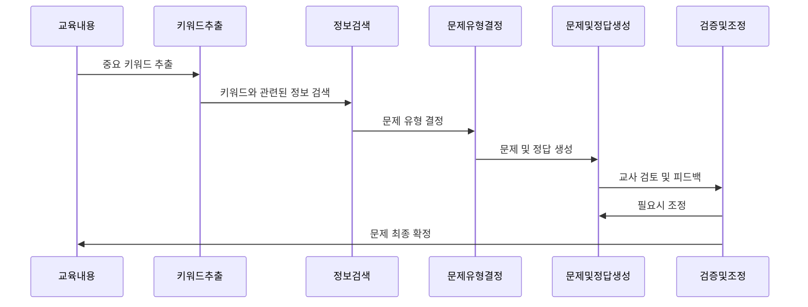
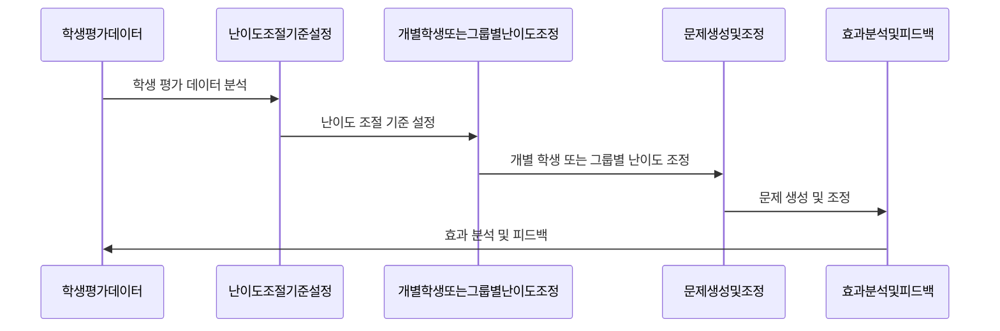
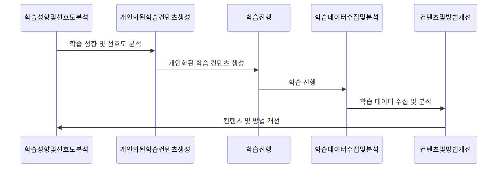

USmartor는 태블릿 장치를 활용한 무선기반 스마트스쿨 솔루션으로, 교육 현장에서의 효율성과 참여도를 높이기 위해 다양한 기능을 제공합니다. 특히, 수업 평가 기능은 교사와 학생 모두에게 중요한 부분으로, 객관식, 주관식, OX 퀴즈 등 다양한 형태의 문제를 통해 학습 내용을 평가하고 이해도를 확인할 수 있습니다.

이러한 문제풀기 컨텐츠의 제작과 관리를 보다 효율적으로 수행하기 위해, USmartor는 LLM(대규모 언어 모델)을 활용한 기능 개발을 진행하고 있습니다. LLM을 활용함으로써, 다음과 같은 기능들을 구현할 수 있습니다:

## 1. **자동 문제 생성:** 교육 내용과 관련된 키워드를 기반으로, LLM이 자동으로 객관식, 주관식, OX 퀴즈 문제를 생성합니다. 이를 통해 교사는 수업 준비 시간을 단축하고, 다양한 문제를 쉽게 준비할 수 있습니다.

자동 문제 생성 기능은 RAG(Retrieval-Augmented Generation)를 활용하여 다음과 같은 순서로 처리됩니다:

    1. **키워드 추출 및 관련 정보 검색:** 교육 내용에서 중요한 키워드를 추출하고, 이 키워드와 관련된 정보를 대규모 데이터베이스에서 검색합니다. RAG는 이 과정에서 LLM과 정보 검색 기술을 결합하여, 문제 생성에 필요한 배경 지식을 수집합니다.
    2. **문제 유형 결정:** 검색된 정보와 추출된 키워드를 바탕으로, 생성할 문제의 유형(객관식, 주관식, OX 퀴즈 등)을 결정합니다. 이때, LLM은 교육 목표와 학습자의 수준, 그리고 검색된 정보의 성격을 고려하여 최적의 문제 유형을 선택합니다.
    3. **문제 및 정답 생성:** 결정된 문제 유형에 맞게 문제를 생성합니다. RAG는 검색된 정보와 LLM을 활용하여, 키워드와 관련된 문장을 구성하고, 정답과 오답 옵션을 제시합니다.
    4. **검증 및 조정:** 생성된 문제는 교사의 검토를 거쳐, 필요한 경우 조정됩니다. LLM은 교사의 피드백을 학습하여, 향후 문제 생성 과정을 개선합니다. RAG 시스템은 이러한 피드백을 통해 검색 알고리즘과 문제 생성 로직을 지속적으로 최적화합니다.
    
    이 과정을 통해, USmartor는 교육 내용에 맞는 다양하고 효율적인 문제를 자동으로 생성할 수 있으며, RAG를 활용함으로써 문제의 다양성과 정확성을 더욱 향상시킬 수 있습니다.

## 2. **문제 난이도 조절:** 학생들의 이해도와 학습 수준에 맞춰 문제의 난이도를 조절할 수 있습니다. LLM은 학생들의 이전 평가 결과를 분석하여, 개별 학생이나 그룹별로 적합한 난이도의 문제를 제안합니다.

    문제 난이도 조절 프로세스는 다음과 같습니다:

    1. **학생 평가 데이터 분석:** LLM은 학생들의 이전 평가 결과와 학습 데이터를 분석하여, 각 학생의 학습 수준과 이해도를 파악합니다.
    2. **난이도 조절 기준 설정:** 교육 목표와 학습 내용을 고려하여, 문제의 난이도를 조절할 기준을 설정합니다.
    3. **개별 학생 또는 그룹별 난이도 조정:** 분석된 학생 데이터와 설정된 기준을 바탕으로, 개별 학생이나 학습 그룹별로 적합한 난이도의 문제를 제안합니다.
    4. **문제 생성 및 조정:** LLM은 제안된 난이도에 맞는 문제를 생성하고, 필요한 경우 교사의 피드백을 받아 문제를 조정합니다.
    5. **효과 분석 및 피드백:** 학생들이 문제를 풀고 난 후, LLM은 정답률, 오답률 등을 분석하여 문제 난이도 조절의 효과를 평가하고, 교사에게 피드백을 제공합니다.

    이 프로세스를 통해, USmartor는 학생들의 학습 수준에 맞는 맞춤형 문제를 제공하여, 학습 효율을 높일 수 있습니다.
    

## 3. **학습 피드백 제공:** 학생들이 문제를 풀고 난 후, LLM은 자동으로 정답률, 오답률 등을 분석하여 교사에게 피드백을 제공합니다. 이를 통해 교사는 학생들의 학습 상황을 더 잘 이해하고, 필요한 경우 보충 수업이나 개별 지도를 계획할 수 있습니다.
학습 피드백 제공 프로세스는 다음과 같습니다:

    1. **문제 풀이 데이터 수집:** 학생들이 문제를 풀고 난 후, 그 결과를 LLM이 수집합니다.
    2. **데이터 분석:** LLM은 수집된 데이터를 분석하여, 학생들의 정답률, 오답률 등을 파악합니다.
    3. **피드백 생성:** 분석된 데이터를 바탕으로, 학생들의 학습 상황에 맞는 피드백을 생성합니다.
    4. **피드백 제공:** 생성된 피드백은 교사에게 제공되며, 교사는 이를 학생들에게 전달합니다.
    5. **개선안 도출:** 교사와 LLM은 제공된 피드백을 바탕으로, 학습 개선안을 도출합니다.

    ### 학습 피드백 제공 기능 요약 표

    | 단계 | 설명 |
    | --- | --- |
    | 문제 풀이 데이터 수집 | 학생들의 문제 풀이 결과를 LLM이 수집 |
    | 데이터 분석 | 정답률, 오답률 등 학생들의 문제 풀이 데이터 분석 |
    | 피드백 생성 | 분석된 데이터를 바탕으로 학습 피드백 생성 |
    | 피드백 제공 | 생성된 피드백을 교사에게 제공, 교사는 학생들에게 전달 |
    | 개선안 도출 | 제공된 피드백을 바탕으로 학습 개선안 도출 |

## 4. **개인화된 학습 경험:** LLM은 학생들의 학습 성향과 선호도를 분석하여, 개인화된 학습 컨텐츠를 제공합니다. 이를 통해 학생들은 자신에게 맞는 학습 방식으로 내용을 이해하고, 학습 효율을 높일 수 있습니다.

    ### 개인화된 학습 경험 제공 기능 요약 표
    | 단계                       | 설명                                                         |
    | -------------------------- | ------------------------------------------------------------ |
    | 학습 성향 및 선호도 분석   | 학생들의 과거 학습 데이터와 반응을 분석                      |
    | 개인화된 학습 컨텐츠 생성 | 분석된 학습 성향과 선호도를 바탕으로 맞춤화된 학습 컨텐츠 생성 |
    | 학습 진행                  | 학생들이 생성된 개인화된 학습 컨텐츠를 통해 학습 진행         |
    | 학습 데이터 수집 및 분석   | 학습 과정에서 발생하는 데이터를 수집 및 분석하여 학습 효과 평가 |
    | 컨텐츠 및 방법 개선        | 수집된 데이터와 학생의 피드백을 바탕으로 학습 컨텐츠와 방법 지속적 개선 |

    1. **학습 성향 및 선호도 분석:** 학생들의 과거 학습 데이터와 반응을 분석하여, 각 학생의 학습 성향과 선호도를 파악합니다.
    2. **개인화된 학습 컨텐츠 생성:** 분석된 학습 성향과 선호도를 바탕으로, 각 학생에게 맞춤화된 학습 컨텐츠를 생성합니다.
    
    3. **학습 진행:** 학생들은 생성된 개인화된 학습 컨텐츠를 통해 학습을 진행합니다.
    
    4. **학습 데이터 수집 및 분석:** 학습 과정에서 발생하는 데이터를 수집하고 분석하여, 학습 효과를 평가합니다.
    
    5. **컨텐츠 및 방법 개선:** 수집된 데이터와 학생의 피드백을 바탕으로, 학습 컨텐츠와 방법을 지속적으로 개선합니다.

USmartor의 LLM 활용 기능 개발은 교육 현장에서의 효율성과 학습 효과를 극대화하기 위한 중요한 단계입니다. 이를 통해 교사와 학생 모두에게 더 나은 교육 경험을 제공할 수 있을 것으로 기대됩니다.

### LLM 활용 기능 요약 및 난이도 표

| 기능 | 설명 | 난이도 (1~5) |
| --- | --- | --- |
| 자동 문제 생성 | 교육 내용과 관련된 키워드를 기반으로 LLM이 자동으로 문제를 생성 | 3 |
| 문제 난이도 조절 | 학생들의 이해도와 학습 수준에 맞춰 문제의 난이도를 조절 | 4 |
| 학습 피드백 제공 | 학생들의 문제 풀이 결과를 분석하여 교사에게 피드백 제공 | 4 |
| 개인화된 학습 경험 | 학생들의 학습 성향과 선호도를 분석하여 개인화된 학습 컨텐츠 제공 | 5 |

